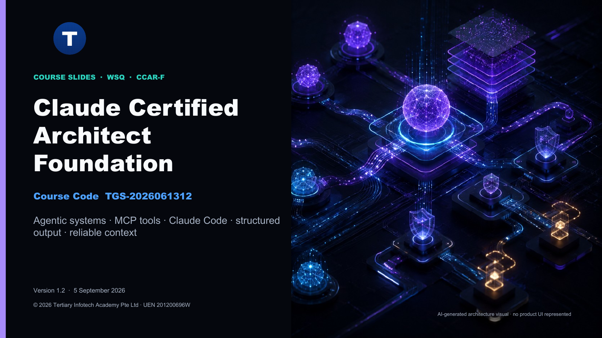

# Claude Certified Architect Foundation

**WSQ Course Code:** TGS-2026061312  
**Duration:** 2 days / 16 hours  
**Courseware release:** v1.2<br>
**Provider:** Tertiary Infotech Academy Pte Ltd (UEN 201200696W)

This learner repository accompanies the [Claude Certified Architect Foundation course](https://www.tertiarycourses.com.sg/wsq-claude-certified-architect-foundation.html). It develops the architecture judgment required to build bounded agentic systems, precise tool and MCP integrations, scalable Claude Code workflows, validated structured outputs, and provenance-aware reliability controls.

## Courseware preview



The v1.2 courseware uses a projector-ready dark theme and integrates concepts OCR-derived from the complete instructor reference set into the five certification domains. It rebuilds the source material as editable architecture diagrams, control flows, diagnostic matrices, charts, and implementation models; no source screenshots are pasted into the instructional slides.

[Open the published courseware folder](https://drive.google.com/drive/folders/1zW_SFmsMMU9i8Efs8XGUTFhNImthzzz1)

## Exam-domain alignment

| Domain | Weight |
|---|---:|
| Agentic Architecture & Orchestration | 27% |
| Tool Design & MCP Integration | 18% |
| Claude Code Configuration & Workflows | 20% |
| Prompt Engineering & Structured Output | 20% |
| Context Management & Reliability | 15% |

## Labs

Each lab is self-contained, offline-first, and includes fixtures, runnable artifacts, acceptance checks, a verifier, and a PDF guide.

1. [Customer Support Resolution Agent](labs/lab-01-customer-support-agent/README.md)
2. [Claude Code Team Workspace](labs/lab-02-claude-code-workspace/README.md)
3. [Multi-Agent Research System](labs/lab-03-multi-agent-research/README.md)
4. [Developer Productivity Agent](labs/lab-04-developer-productivity-agent/README.md)
5. [Claude Code CI Review](labs/lab-05-claude-code-ci-review/README.md)
6. [Structured Data Extraction](labs/lab-06-structured-data-extraction/README.md)

Run a lab verifier from its folder:

```bash
python3 -B verify.py
```

## Reference acknowledgement

The original lab scenarios were informed by publicly available study projects from [Paul Larionov](https://github.com/paullarionov/claude-certified-architect), [Ade Regil](https://github.com/aderegil/claude-certified-architect), and [Daron Yondem](https://github.com/daronyondem/claude-architect-exam-guide). No assessment or solution content from those repositories is redistributed here.

## Public/private boundary

This repository contains learner-safe lab material only. Trainer decks, learner-management links, assessment papers, answer keys, reference screenshots, credentials, build tooling, and QA evidence are intentionally excluded.

Course funding support shown on the course page is subject to current eligibility rules and approval.
